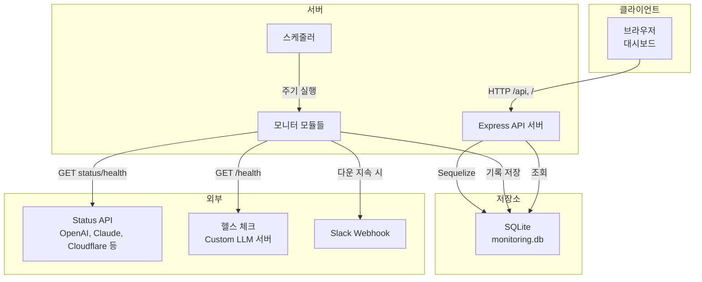

# LLM·외부 서비스 통합 모니터링 대시보드 기획안

## 1. 개요

| 항목 | 내용 |
|------|------|
| **서비스명** | LLM·외부 서비스 통합 모니터링 대시보드 |
| **목적** | LLM 서비스(ChatGPT, Claude, Gemini 등)와 외부 인프라(Cloudflare, Twilio, 채널톡, AWS)의 상태를 한 화면에서 모니터링하고, 이상 시 알림으로 신속 대응 |
| **대상** | 서비스 운영자, DevOps |

---

## 2. 배경 및 요구사항

- LLM 및 외부 API 장애를 수동 확인 없이 **자동 감지·알림** 필요
- 각 서비스의 Status API 또는 헬스 체크를 **주기적으로 호출**해 기록·통계 제공
- 오류 수준(INFO ~ CRITICAL)에 따른 **분류 및 Slack 알림**으로 대응 시간 단축

---

## 3. 기능 범위

### LLM 서비스

- **Custom 서버**: 설정된 LLM 서버(헬스 체크 엔드포인트) 주기 확인
- **OpenAI Status API**: 공식 상태 페이지 API 모니터링
- **OpenAI API 직접 호출**: API 키 기반 실제 호출 모니터링 (선택)
- **Claude**: Anthropic Status API
- **Gemini**: Status 페이지 또는 API 기반 모니터링

### 외부 서비스

- **Cloudflare**, **Twilio**, **채널톡**: Statuspage.io 형식 API
- **AWS**: 상태 페이지 도달 가능성 모니터링 (공식 Status API 없음)

### 공통

- 주기 자동 체크 (기본 60초), 응답 시간·상태 기록
- 오류 수준 판정 (WARNING/ERROR/CRITICAL 임계값)
- 알림 생성·해결, REST API 제공
- 웹 대시보드: 상태 카드, 상태 통계(도넛), 응답 시간 추이, 최근 기록·알림 테이블

---

## 4. 아키텍처

- **브라우저**: 대시보드(HTML/CSS/JS, Chart.js)가 API를 통해 데이터 조회
- **Express**: REST API 및 정적 파일 서빙, 스케줄러 기동
- **스케줄러**: 설정된 주기(MONITORING_INTERVAL)마다 각 모니터 모듈 실행
- **모니터 모듈**: 해당 서비스 Status API 또는 헬스 체크 호출 후 결과를 DB에 저장, 필요 시 Slack 발송

---

## 5. 비기능 요구사항

- **설정 기반**: 환경 변수(.env)로 모니터링 대상·주기·알림 on/off
- **DB 교체 가능**: 기본 SQLite, `DATABASE_URL`로 다른 DB 사용 가능
- **비밀 정보 분리**: API 키, Slack Webhook 등은 .env에만 저장 (.gitignore 대상)

---

## 6. 기술 스택

- **런타임**: Node.js 18+
- **서버**: Express
- **ORM/DB**: Sequelize, SQLite (기본)
- **프론트**: Vanilla JS, Chart.js
- **기타**: axios, dotenv

---

## 7. 데이터·UI 개요

### 주요 모델

- **모니터링 기록**: timestamp, provider, status, response_time_ms, error_message, http_status_code, additional_data
- **알림**: timestamp, error_level, message, resolved

### UI 구조

- **탭**: LLM 서비스 / 외부 서비스
- **공통**: Provider별 상태 카드(응답 시간, 건강도), 상태 통계(도넛 차트), 응답 시간 추이(라인 차트), 최근 기록·알림 테이블
- **CRITICAL 시**: 상단 배너 표시

---

## 8. 향후 계획

- 공지사항 자동 등록 기능 연동
- 띠배너 자동 표시 기능 연동
- 이메일 알림 연동
